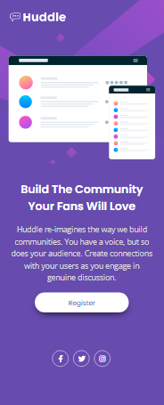

# Frontend Mentor - Huddle landing page” com uma única seção introdutória.

## Bem vindo! 👋

Obrigado por conferir meu projeto que é um  desafio de codificação do site: [Frontend Mentor](https://www.frontendmentor.io) .

Podemos visualizar o projeto "Hudlle landing page" na versão:
## Desktop-design 

## Mobile-design

## Índice

- [Meu processo](#meu-processo)
  - O projeto foi construído com o que aprendi no curso DevQuest nas aulas de HTML5 e CSS3, colocando em prática os conhecimentos adquiridos durante as aulas. 

## Estilo do projeto

### Layout
  - O projeto foi criado nas seguintes larguras:
    - [Desktop: 1440px](#desktop-design) 
    - [Mobile: 375px](#mobile-design)

### Cores
  - Violeta: hsl(257, 40%, 49%)
  - Magenta suave: hsl(300, 69%, 71%)

## Tipográfia

### Títulos
- Family: [Poppins](https://fonts.google.com/specimen/Poppins)
- Weights: 400, 600

### Corpo
- Family: [Open Sans](https://fonts.google.com/specimen/Open+Sans)
- Weights: 400

### Icones
Para os ícones sociais, você pode usar uma biblioteca de ícones de fontes. Algumas sugestões podem ser encontradas abaixo:
- [Font Awesome](https://fontawesome.com/)
  

## Visão Geral

### O Desafio
- Visualizar o layout ideal para página, dependendo  do tamanho da tela do dispositivo e colocar os elementos interativos na página.

## Meu processo

### Criando com
- Marcação HTML5 semântica
- Propriedade personalizadas do CSS3
- Flexbox
- Media Queries

### O que aprendi
Nesse projeto trabalhei com Flexbox, isso me ajudou a colocar em prática o conteúdo que havia estudado. 

No início do projeto achei que iria precisar usar o Grid também, conforme fui desenvolvendo-o, fui entendo que apenas o uso do flexbox séria necessário para esse projeto.
Trabalhei bastante com o responsivo (media queries),  pois dependendo do tamanho da tela, o layout tem ficar responsivo para página.

### Desenvolvimento contínuo

Continuar a treinar em projetos pequenos o HTML e CSS, os seguintes conteúdos: as marcações semânticas no HTML e Flexbox, Grid e a responsividade no CSS, acho essencial que eu continue a praticar, para que eu possa ganhar mais conhecimentos e habilidades.

## Author

-  GitHub - [@deborafsilva](https://deborafsilva.github.io/Quest-html-css-avancado-Huddle-landing-page/)
- Linkedin - [Debora Fernandes da Silva | www.linkedin.com/in/deborafernandesdasilva](www.linkedin.com/in/deborafernandesdasilva)

